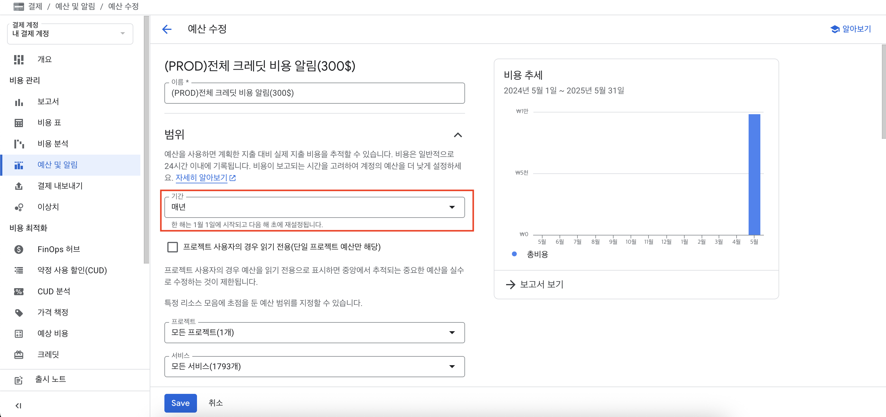
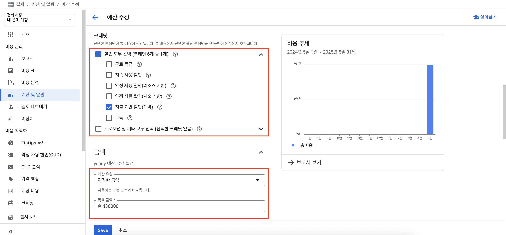

# 디스코드 봇 GCP 비용 알림

### 📌 주요기능 

1️⃣ 예산 임계치 초과 시 자동 알림 전송

: GCP 예산에 설정된 기준을 초과하면 Discord 채널로 경고 메시지를 전송합니다.


2️⃣ 일일 비용 알림 (매일 오전 09:00~09:59)

: 현재까지의 누적 비용을 매일 정해진 시간에 자동 전송해줍니다.


## 준비

#### 1. 디스코드 채널에서 웹훅을 만들어 URL을 복사합니다.

#### 2. 복사한 URL을 `.env` 파일의 `DISCORD_WEBHOOK_URL=` 값에 붙여넣습니다.

## 사용방법
### 1. GCP 예산 및 알림 설정
예산 및 알림 페이지에서 예산을 추가합니다. 아래 사진을 참고해서 추가해주세요.


-> 범위: `매년`으로 설정해야 월이 넘어가도 총 금액을 추적할 수 있습니다.


-> 크레딧: `지출 기반 할인(계약)`만 선택합니다.<br>
-> 예산: 예산의 최대치를 입력합니다. ($300 ≒ 430,000원)


-> 초과 알림을 받을 예산 임계치를 입력합니다.


-> `결제 관리자 및 사용자에게 이메일 알림`과 `Pub/Sub 주제를 이 예산에 연결`을 선택합니다.


-> `주제 만들기` 버튼을 클릭하여 주제(Pub/Sub)를 생성합니다.<br>
-> 이때 주제 이름은 `billing-alerts`여야 합니다.

=> **해당 과정이 끝나면 예산을 Save 합니다.**

### 2. gcloud 설치 및 준비
로컬PC에 glcoud를 설치합니다. (gcloud 설정 방법은 따로 찾아봐주세요.)

```bash
gcloud components install pubsub-emulator
gcloud init
```

### 3. `1.setup.sh` 스크립트 실행
해당 스크립트를 실행하여 GCP에 로그인 합니다.
(브라우저가 열리는데 사용할 GCP 계정으로 로그인 하면 됩니다.)

해당 스크립트는 로그아웃 후 로그인을 하는 스크립트로, gcloud 설정을 처음하신다면 다음과 같은 오류가 발생할 수 있습니다.(이 경우에는 무시하셔도 됩니다.) =>
`ERROR: (gcloud.run.services.describe) You do not currently have an active account selected.` 

### 4. 필요한 권한 활성화
다음 명령어를 통해 필요한 권한을 활성화 합니다.
```bash
gcloud services enable \
run.googleapis.com \
compute.googleapis.com \
iam.googleapis.com \
pubsub.googleapis.com \
cloudbuild.googleapis.com
```

### 5. `2.deploy.sh` 스크립트 실행
해당 스크립트를 실행하여 cloud run 및 pub/sub 구독을 생성합니다.

### 6. `3.test-webhook.sh` 스크립트 실행
해당 스크립트를 실행하여 Cloud Run이 정상적으로 실행되는지 확인합니다. (디코 웹훅으로 알림이 오면 성공)

❗ 해당 테스트 코드는 Cloud Run에 대한 테스트로, 9시에 오는 `일일 비용 알림`은 다음 날 오는 알림으로 확인해야합니다.


## 참고사항

- `2.deploy.sh` 를 실행할 때 iam 오류가 뜬다면, `1.setup.sh`를 통해 재로그인 후 다시 시도해주세요.

- `2️⃣ 일일 비용 알림` 기능은 09:00~09:59 사이에 여러 번 전송될 수 있습니다.

## 문의

Issues를 통해 부탁드립니다.
